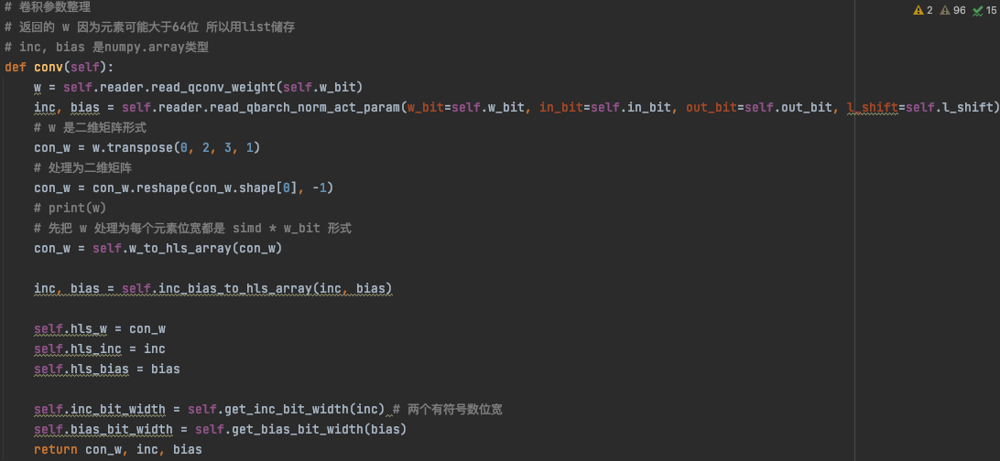
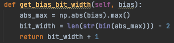
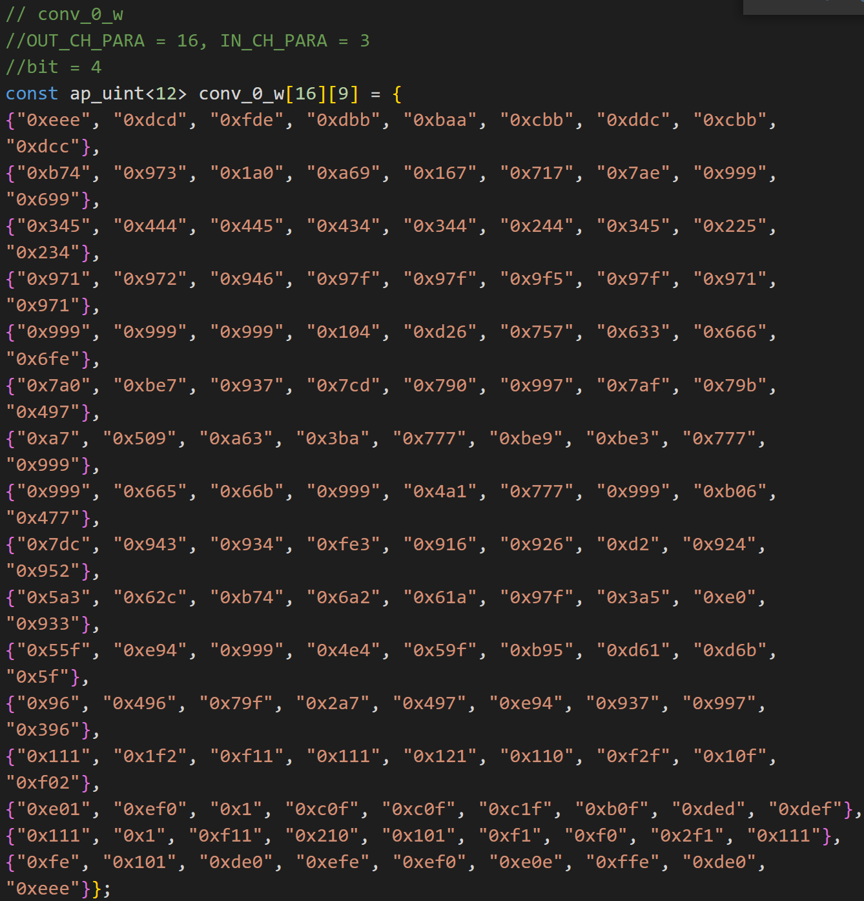

## 项目介绍
- DAC-SDC 的 DJI UAV 单目标检测比赛
- 从 2020 年冠军 ultranet 以来，2021 年的队伍基本上都采用了类似的流式加速器结构，相比于 2019 年冠军 skynet、2020 年亚军 skrnet 的专用加速器而言，由于可以采用层间流水线结构（后者只是在层内计算时使用数据加载部分和计算部分相互重叠来提升吞吐量，效果非常有限），fps 有了显著的提升。
  - 有关数据流式加速器的设计部分，参考 FINN 的 GitHub 仓库以及相关文章资料。
  - 比较重要的几个概念
    - Conv 如何转成 GEMM （im2col）
    - FINN 的设计
      - 两个并行度参数
        - SIMD
        - PE
- 本仓库从 2021 年 SJTU repo 而来，修正了其中的一些 bug，但在测试集（1000张）上的最佳 IOU 仅达到了 64.5%，将其主要思路记录如下。
- 训练部分，量化感知训练，参照 DoReFa。

## 训练

train.py

- 借鉴开源工程 ultralytics 的 YOLOV3 实现

  - https://github.com/ultralytics/yolov3

- 改动（本任务与 YOLO 任务的区别）
  - 单目标检测任务，不需要分类，class 的数量为 1
  - 使用的 6 个 anchors 均为同样的尺寸，结果取它们的平均值，类似于多个模型取平均

### 带有量化的训练（dorefa）

- 网络结构
  - 量化部分
    - conv
      - 量化权重，均匀对称量化，采用 dorefa 的形式
    - activation
      - 量化激活值，均匀非对称量化，先 clip 到 [0, 1]，再量化
  - 正常部分
    - BN
      - 在训练中不量化，在导出参数时，使用 l_shift 参数增加中间结果的位宽保证精度
    - MaxPooling

#### conv2d_q

- 按照 W_BIT 的设定去量化权重

- 关键是 forward 函数中的 weight_quantize_fn，如何量化权重

  - 采用 dofera 中的方法

    - 对权重做归一化到 (0, 1)

    - 均匀量化为有符号数，注意这里传入的比特数为 w_bit - 1，来做对称量化

      $$
      w^q = Quantize_k(\frac{tanh(w)}{abs(tanh(w)}) (k = w\_bit - 1)
      $$

      

- 均匀量化
  - fake_quantization 来模拟量化带来的精度损失
  - 实现
    - 在函数内部定义了一个继承 autograd.Function 的类，自定义 forward backward 函数，实现前向传播中对量化的模拟，反向传播中的 STE

#### act_q

- 针对激活值的量化
  - 用 (0, 1) 截断 ReLU1
  - 非对称均匀量化，这里传入的比特数为 a_bit
  $$
  a^q = Quantize_k(clip(a, 0, 1)) (k = a\_bit)
  $$

### 网络结构

#### ultranet(2020)

类 VGG 网络 + YOLO Layer

- nn.sequential
  - block1

    - conv
    - bn
    - relu1
    - maxpooling

  - block2

  - block3

  - block4

    ---

  - block5

    - conv
    - bn
    - relu1

  - block6

  - block7

  - block8

    ---

  - conv

    - ouput_channel 36
    - 6(n_anc) x 6(x, y, w, h, conf, class)

- YOLO Layer

  - 6 个大小相同的 anchor，将这些 anchor 取平均
  - 最主要的是 Loss 与该逻辑对应即可

#### SJTU(2021)

- 在以上网络结构的基础上增加了 skynet 中提到的 skip 结构，可以有效提升小目标检测能力（IOU 指标）
- 需要在 HLS 部分增加与之匹配的逻辑，即
  - StreamBrodcast
    - 分流
  - Reorg
    - 重排
  - StreamConcat
    - 拼接

## 导出参数及配置信息

torch_export.py

### 参数

generate_params( )

- 将训练好的网络参数导出到 dict 字典中
- 包括
  - conv
    - weight
    - bias（如果存在）
  - linear
    - weight
    - bias（如果存在）
  - bn
    - gamma
    - beta
    - running_mean
    - running_var
    - epsilon

- 将该信息保存在 .npz 文件中

### 配置信息

generate_config( )

注意其中的 in_shape out_shape 由于 pytorch 机制问题需要手动输入并写出相应计算逻辑，有一定局限性

- conv

  - in_shape

  - out_shape

  - k

  - s

  - p for padding

    

- maxpooling

  - in_shape

  - out_shape

  - p

    

- linear

  - in_len
  - out_len

- json.dumps 函数
  - 将网络中关键层的信息保存为 json 文件

## 量化并导出 hls 配置文件

### 顶层配置与操作

ultranet_param_gen.py 中进行

- 量化参数的配置
  - 量化位宽
    - 权重激活值均使用 4 比特数据
  - 并行度
    - [ ] 其配置逻辑有待进一步研究
    - simd
    - pe
  - BN 层中间结果位宽扩张来获得更高精度
    - l_shift

- 网络量化的顶层操作
  - 网络参数文件 .npz
  - 网络配置文件 config.json

### QNNLayerMemProcess

qnn_mem_process.py

QNNLayerMemProcess 类来量化网络结构中的一个以 conv 为起始层的 block 结构 (共 8 个 block 加上最后一个单独的 conv 层)

- config 网络配置文件

- name 网络配置文件中 conv 所对应的 key
  - conv\_0

- reader 一个网络参数文件的读取器

  - qnn_param_reader.py

  - QNNParamReader 类

    - 按照参数名称读出保存在 .npz 文件中的相应数据
    - 并结合 quantization.py 进行相应量化操作并输出

    

- w_bit 网络权重比特数

- in_bit 输入激活值位数

- out_bit 输出激活值位数

- l_left 放大因子

- pe (processing element) 

  - 基本计算单元个数
  - 对应输出通道上的并行度

- simd (single instruction multiple data) 

  - 单指令多数据个数
  - 对应输入通道上的并行度

### 一个 block 的整理

处理一个 block 参数的量化

- conv
- BN

#### read_qconv_weight

- conv 层的量化（weight 参数）

- 在训练过程中采用 dofera 方法对 weight 进行量化

- 通过 processer 中的 reader 读取 weight 参数，并根据 量化配置 量化

- 权重量化与训练中的量化方法保持一致

#### read_qbarch_norm_act_param

- BN 层的量化 

  - 在训练过程中并没有对 BN 层的参数进行相关量化操作

- 首先拿出 BN 层原始参数

- 其次对其进行量化操作

  

  - 首先将 BN 层转换成 conv 层求出等效的 w,b

    

  - 其次将 w,b 量化到合适的尺度，进行乘加运算

    - 即 (l\_left + w\_bit + a\_bit + out\_bit) 这样一个位宽
    $$
    2^{(l\_left+w\_bit+in\_bit-1)}*(2^{out\_bit}-1)
    $$

    - l_left 参数
      - 通过扩大中间值的量化表示范围，一定程度上减少精度损失

    - 使用进行完中间计算后，通过移位操作将数据变成下一层需要的位宽
    $$
    mid\_result >> (l\_left + w\_bit + a\_bit)
    $$

#### 将 conv 层参数转为 hls 格式

##### 维度转换

- 变换参数维度
  - 将 输入通道 变为最低维度
  - (32,16,3,3) -> (32,3,3,**16**) -> (32,144)

  

- 进行转换

##### 拼接

- 每次读入 simd 个权重数据，并对其进行拼接

- 将权重参数从低位到高位依次填充，拼接得到的数据不断循环左移

- 拼接后的数据拥有 simd 个输入通道上某一位置上的数据

  

##### tiles 含义

- 得到输出 FM 一个位置的数据需要多少个时钟周期的计算

  (output_channel / pe) * (kernel_size ^ 2 * input_channel / simd)，其中

  - 总计算量 
    - output_channel * kernel_size ^ 2 * input_channel

  - 并行度 
    - pe * simd

  - output 维度需要这些个 pe 计算多少组

  - input*kenel_size^2/simd 维度需要每个 pe 计算多少次

#### 将 BN 层参数转为 hls 格式

同样是转换成 \[#pe\]\[#tiles] 的格式
- 注意这里，没有 c\_in 维度上，simd 这个并行度，因为 BN 层本身的 weight、bias 位宽就已经很大了
- tiles 需要多少个时钟的计算
  - 在某个 tile 中，每个 pe 会被分到其对应的参数
- 计算核心的并行度 pe*simd

#### 得到 BN 层两个量化参数的位宽

- 得到该层 BN 权重和偏移所需要的位宽
  - 偏移所需要的位宽为 (w\_bit + a\_bit + l\_left + out\_bit)
  - [ ] 中间结果所需要的位宽应该是大于这个值，也可能就是这个值，具体需要看一下 HLS 代码

### 保存网络参数文件 param.h

- 将 [#pe\]\[#tiles\] 形式的参数转换成 HLS 代码

- 本质是将量化后的网络参数转换成 C 可以直接使用的字符串，依次保存

- conv 
  - weight
    - 是拼接形式，simd 个数据拼接为一个
- BN 
  - weight & bias
  - 由于其本身位宽就很长，所以不拼接

- 经过以上步骤，可以得到如下形式的权重文件
  - 其中，第一个维度为 pe 的并行度（在 c\_out 上的并行度），第二个维度为 tiles 的数量，即得到输出一个值需要的时钟周期数，这么多个 pe 需要加载多少次数据，完成多少次计算。

### 保存网络配置文件 config.h

- 将所有硬件计算需要用到的信息保存

- 转换为 C 可以直接使用的字符串

### 最后一层 conv 的处理

- 本质上是一个特殊的 block
  - 只有 conv，没有后续的 BN ReLU MaxPooling 
  - 每一个步骤减去一些部分的操作即可

## hls

- 将网络所有参数放到片上，只会在加载图片时访问外部存储 DDR，速度更快

- 但这也导致丧失了一定的灵活性
  - 网络参数量不能太大
  - 每次更新参数需要重新生成 hls IP 核，导出 vivado 比特流

- 使用的是 hls 中的 stream 数据流的概念

  - 参见 http://xilinx.eetrend.com/content/2020/100050709.html

### 概览

- 简要介绍 hls 中有关 ultranet 的实现部分，这里的基本组件应该还是用的赛灵思开源的库
- 代码组织结构
  - top.cpp 中将底层各个模块拼接成神经网络结构
    - 包括 conv1x1.h conv3x3.h maxpool.h...
  - testbench.cpp 中对 top.cpp 的正确性做验证
- hls 部分包括了对图像的 resize 操作，见后面各部分所占时间的关系图，使用 PS 分担 PL 的工作量 

### top.cpp 中的内容
#### 模板
- 建议：对此处 C++ 概念不是很清楚的朋友可以看一下 b 站上黑马关于 C++ 的课程
- HLS 中所使用的 C++ 模板（把类/函数中参数类型参数化的过程）
  - 需要在 <> 中给出参数类型，在 ( ) 中提供该类进行实例化所需要的参数
- 类模板

- 函数模板（在 <> 中给出的还是参数，两个均是 unsigned 数据类型）

#### 数据类型
- 整个IP 核的输入输出 
  - axi 数据类型（是一个自定义的结构体）
    - data 数据位宽为 64 位
    - last 标志位，标记最后一个数据

#### resize
- 均是调用 hls 内部视频处理库
- 将 stream 转为 matrix
- 在 matrix 上做 resize
- 将 resize 之后的 matrix 转成 stream 输出

#### padding
- 做 conv 第一步需要先 padding
  - 如下图所示
  

#### shift register(sliding window)
- 使用 shift register 来做 sliding window，类似于一个蜿蜒爬行的贪吃蛇
  

#### pe
- 使用 FPGA 中的 DSP 资源计算卷积（每次可以算两个 mul）
  - 注意高位计算结果要 + 与其紧邻的低一位的值（补码形式）
- 计算逻辑
  - c\_in iters (k * k * c\_in / simd)
  - c\_out iters (c\_out / pe)
  - data points
    - H \* W
- 位宽
  - 累加器位宽
    - 直接给的 M\_BIT 24
    - 此值由下面三项的乘积决定（会不会溢出）
      - w\_bit int4
      - a\_bit uint8
      - nums of int12 middle res (k * k * c_in)

##### mul for each iter
- 使用 FPGA 中的 dsp 资源计算两个 mul

##### BN-ReLU
- BN 转成 conv 计算，用 weight bias 算，对每一个 output 中的 data\_point 都要做
- 使用一个 D 用来做一个微小量
- 结果在 (a\_bit + w\_bit + l\_bit + out\_bit) 尺度上，在输出时通过向右位移到 out\_bit 上作为下一层的输入

#### 数据流的处理
- PISO
  - Parallel In and Serial Out (将两个并行的输入数据流转为一个串行的输出流)
  - 全读完之后统一写，需要多少个轮数
    - 对下一层而言，c\_in / data\_width
  

#### maxpooling
- get window data then process

- shift register(sliding window)
- maxpool
  -  处理一个窗口中的数据
  -  result[i] 中记录第 i 个通道的 maxpooling 输出
   

#### reorg
##### 数据流的处理
- 数量均为 H * W
- stream broadcast
  - 一个输入，两个输出

- stream concat
  - 两个输入，一个输出

##### reorg 操作
- 输入数据流
  - 第一个维度 k*k
  - 第二个维度 c\_in\_iters = c\_in / simd
  - 输出的数据位宽为 k\*k\*c\_in\*in\_bit

- 映射
  - Conv2d_Q
    - SWU 滑动窗口单元
    - MVU 矩阵向量单元
  - BN + ReLU1_Q
    - BN_Relu
    - 

- pipeline

  将所有层都置于片上，当上一层有计算输出时，下一层立即开始计算，各层同时运行。

## 部署

- 系统框图

  - 采用DMA搬运数据，CPU负责任务调度工作。

  - 为了实现加速器IP与CPU之间的并行，在外部RAM中开辟了两块缓冲区轮流为加速器提供图片数据。

- 负载调整

  - 在PS端进行多核（多线程）并行优化处理，在PS-PL端进行了负载均衡处理

  - 使得两部分时延相当，谁也不会影响谁

